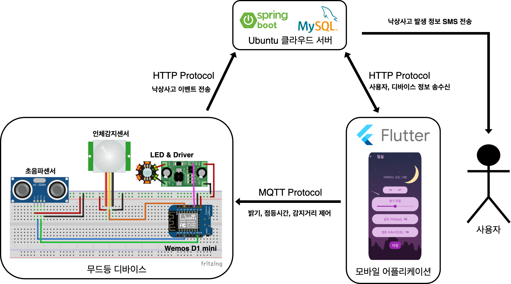
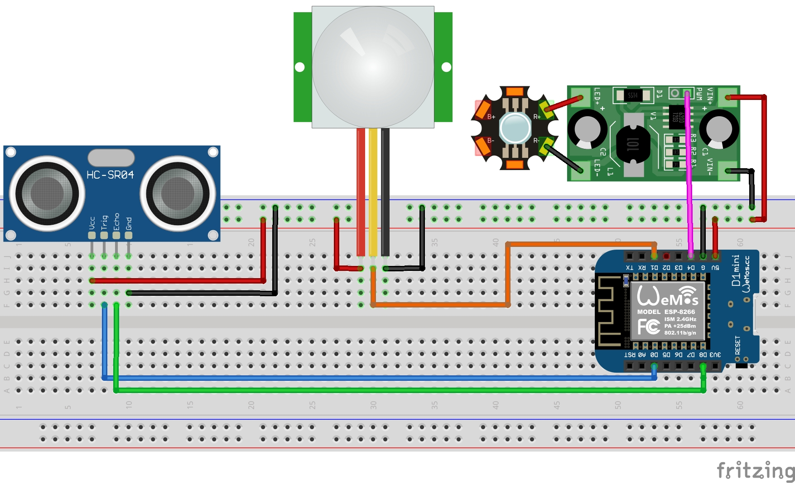
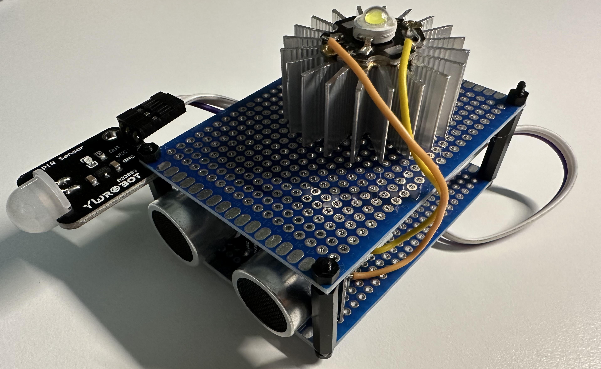
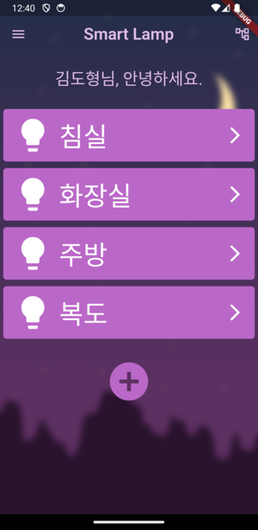
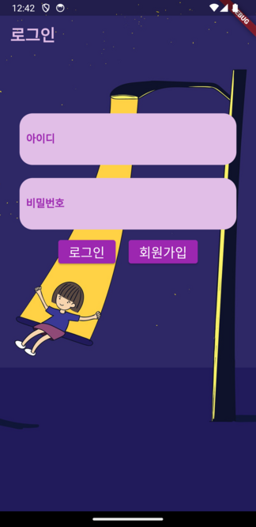
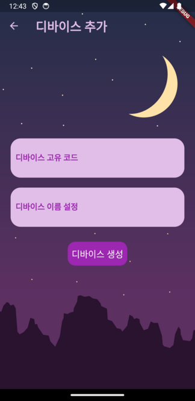
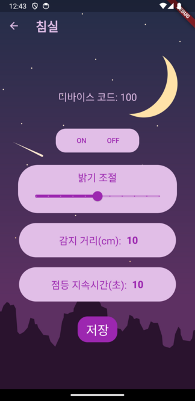

# Smart Lamp Project

## 프로젝트 소개
### 개발배경  
* 노인들에게 야뇨증 등의 이유로 어두운 밤에 화장실을 가는 도중 물건을 잘못 밟거나 걸려 넘어져 낙상사고가 다수 발생한다.  

* 노인은 작은 낙상사고로도 고관절이나 척추를 다칠 가능성이 크며 중상 이상에 이를 수 있으므로 각별한 주의가 필요하다.  

* 밤에 조명을 유지하는 것을 권유하지만 눈 부심때문에 조명을 켜고 잠자리에 드는 것을 선호하지 않는 경우가 있으며, 이동 시 마다 조명을 켜고 끄는 것이 번거로워 조명이 있음에도 잘 활용하지 않는 경우가 있다.   

### 개발목표 및 내용  
* 설정된 감지거리 이내에서 상시 사용자의 움직임을 감지하여 설정된 점등시간과 밝기로 동작  

* 사용자의 모바일 어플리케이션 상에서 다수의 디바이스를 등록 후 조작 및 개인화 설정 가능  

* 어플리케이션 회원등록을 통해 소유한 디바이스의 고유코드를 계정에 등록 후 서버를 통해 디바이스 정보를 등록, 수정, 조회, 삭제 가능  

### 기대효과 및 시장성

* 어두운 밤길로 인한 노인들의 낙상 사고를 방지할 수 있다. 이를 통해 노인들은 더 안전한 환경에서 생활할 수 있게 되며, 부상과 다발 상황의 위험을 줄일 수 있다.  

* 노인 인구가 전 세계적으로 증가하는 추세에 따라 이와 같은노인들을 위한 안전사고 예방 솔루션의 시장 수요가 증가할 것으로 예상된다.  

## 관련 문서
* [한국공학대학교 종합설계 졸업작품](./paper.pdf)

## 아키텍쳐 

| 구성      | 링크 |
|----------|-----|
| Frontend | [Flutter  Application](./client/) |
| Backend  | [Spring REST API Server](./server/) |
| Device   | [Wemos D1 mini(Arduino)](./device/) |

### 다이어그램

### 브레드보드 및 회로 구성도

    
    

## 데모 모델

## 어플리케이션 화면 구성

    

        
        
메인

    

    

        
        
로그인

    

    

        
        
회원가입

    

    

        
        
디바이스 생성

    

    

        
        
디바이스 제어

    

## 데이터베이스 스키마

    <table style="margin-right: 20px; width: 50% ">
        <caption style="text-align:start; font-size:18px; font-weight: 700;">User</caption>
        <tr>
            <th>컬럼명</th>
            <th>설명</th>
        </tr>
        <tr>
            <td>user_id</td>
            <td>사용자 고유 아이디</td>
        </tr>
        <tr>
            <td>user_pw</td>
            <td>사용자 비밀번호</td>
        </tr>
        <tr>
            <td>user_name</td>
            <td>사용자 이름</td>
        </tr>
        <tr>
            <td>phone</td>
            <td>사용자 전화번호</td>
        </tr>
    </table>
    <table style="width: 50% ">
        <caption style="text-align:start; font-size:18px; font-weight: 700;">Device</caption>
        <tr>
            <th>컬럼명</th>
            <th>설명</th>
        </tr>
        <tr>
            <td>unitCode</td>
            <td>디바이스 고유 코드</td>
        </tr>
        <tr>
            <td>unit_name</td>
            <td>디바이스 이름</td>
        </tr>
        <tr>
            <td>brightness</td>
            <td>램프 밝기</td>
        </tr>
        <tr>
            <td>distance</td>
            <td>탐지 거리</td>
        </tr>
        <tr>
            <td>time</td>
            <td>점등 시간</td>
        </tr>
        <tr>
            <td>user_id</td>
            <td>사용자 아이디</td>
        </tr>
    </table>

## 개발 환경

| Target        | Version     |
|---------------|-------------|
| Ubuntu(Azure) | 20.04.6 LTS |
| MySQL(Azure)  | 8.0.35      |
| Java          | openjdk 11  |
| Spring boot   | 2.7.10      |
| Dart          | 2.19.5      |
| Flutter       | 3.7.8       |
| mosquitto     | 1.6.9       |

## 개발 도구

## 사용 기술

