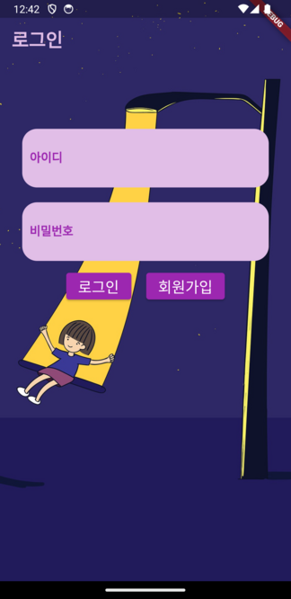

# Smart Lamp Mobile Application

## 프로젝트 구조

```
lib
 ┣ models
 ┃ ┗ unit_model.dart
 ┣ navigator
 ┃ ┗ screen_navigator.dart
 ┣ screens
 ┃ ┣ add_unit_screen.dart
 ┃ ┣ home_screen.dart
 ┃ ┣ join_screen.dart
 ┃ ┣ login_screen.dart
 ┃ ┣ setting_screen.dart
 ┃ ┗ unit_detail_screen.dart
 ┣ service
 ┃ ┣ api_service.dart
 ┃ ┣ mqtt_service.dart
 ┃ ┗ prefs_service.dart
 ┣ widgets
 ┃ ┣ dialog_widget.dart
 ┃ ┗ unit_widget.dart
 ┗ main.dart
```

## 주요 기능 및 화면 구성

### 1. 로그인 화면

  

### 2. 회원가입 화면

  

### 3. 메인 화면

  

### 4. 디바이스 추가 화면

  

### 5. 디바이스 제어 화면

  